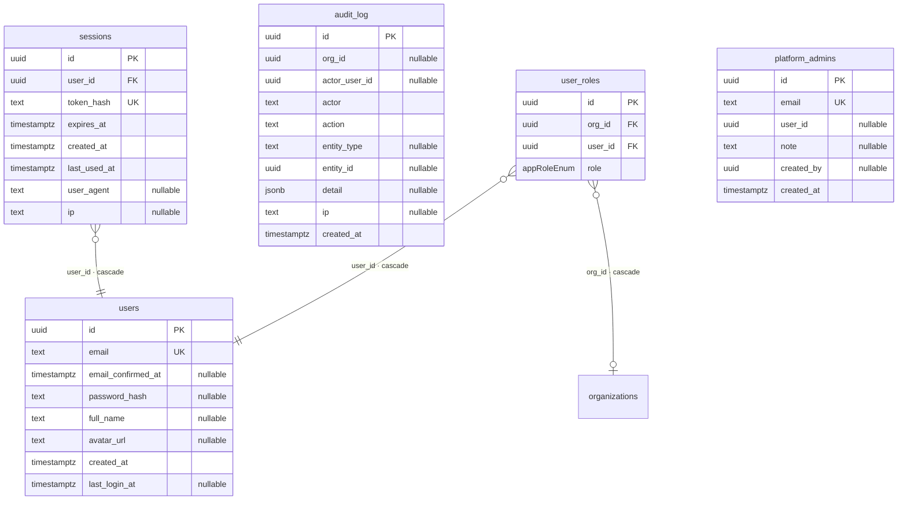
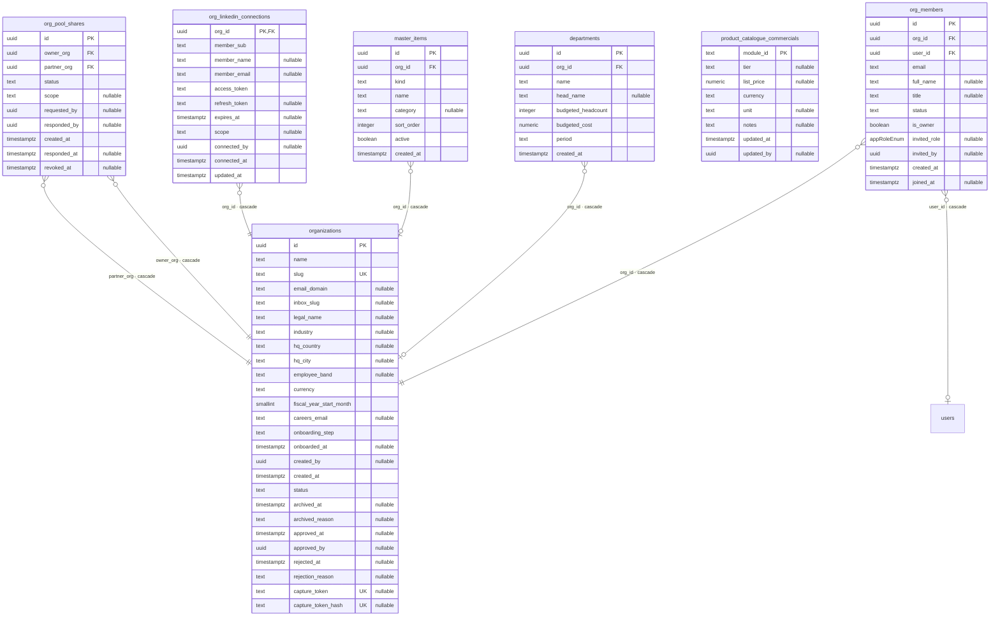
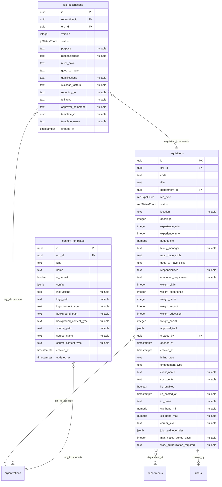
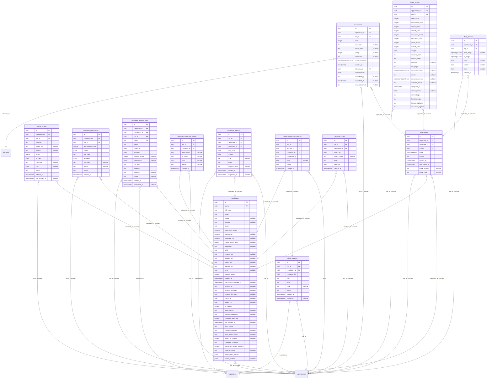
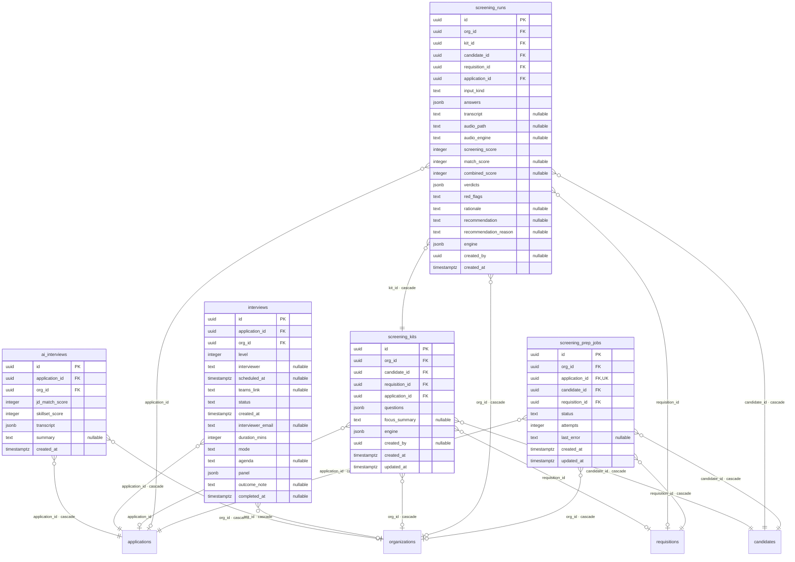
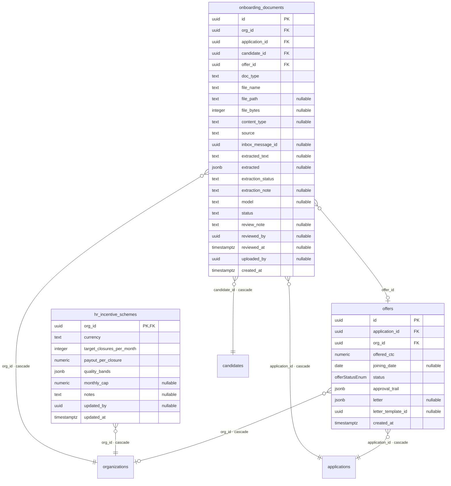
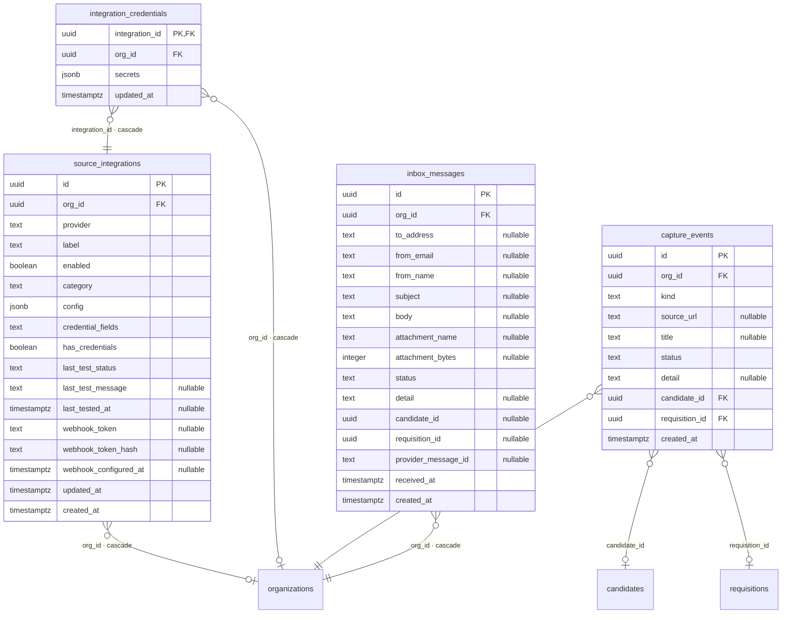
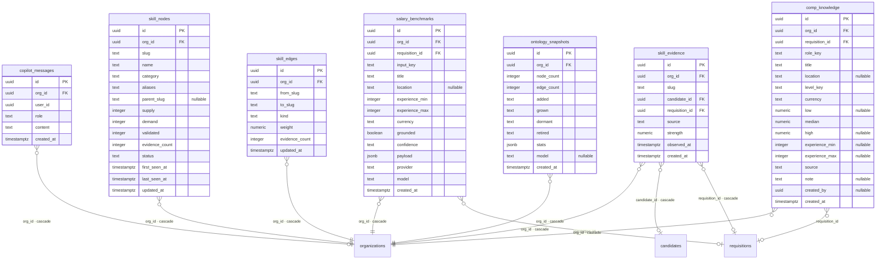
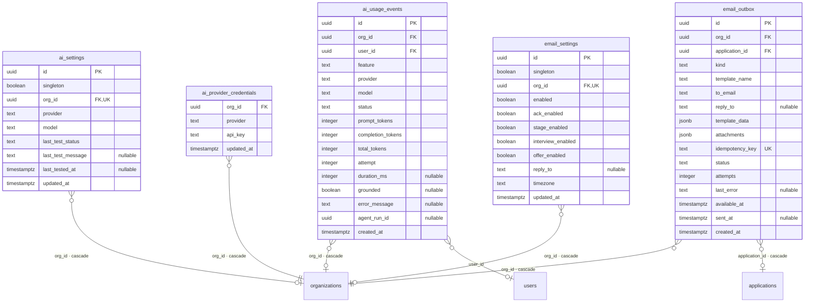

# ATSIQ — Entity-Relationship Diagram

> **Generated file — do not edit by hand.** Source of truth: `drizzle/schema.ts`.
> Regenerate after any schema change: `node scripts/gen-er-diagram.mjs`.
>
> Conventions: attribute keys — `PK` primary key, `FK` foreign key, `UK` unique.
> Unmarked single columns are nullable (noted explicitly). Relationship labels name
> the foreign-key column and call out non-default delete behaviour (e.g. `cascade`).
> A domain diagram shows that domain's tables in full; references into other domains
> point at a stub entity that is drawn complete in its own domain.

72 tables across 9 domains.

## Identity & access

`users`, `sessions`, `audit_log`, `user_roles`, `platform_admins`

## Organisations & masters

`organizations`, `org_members`, `departments`, `master_items`, `org_linkedin_connections`, `product_catalogue_commercials`, `org_pool_shares`

## Requisitions & job content

`requisitions`, `job_descriptions`, `content_templates`

## Candidates & pipeline

`candidates`, `applications`, `stage_events`, `match_scores`, `social_profiles`, `evaluations`, `candidate_verifications`, `candidate_assessments`, `candidate_ownership_events`, `candidate_referrals`, `talent_requests`, `talent_request_suggestions`, `candidate_notes`

## Screening & interviews

`ai_interviews`, `interviews`, `screening_kits`, `screening_runs`, `screening_prep_jobs`

## Offers & onboarding

`offers`, `hr_incentive_schemes`, `onboarding_documents`

## Sourcing & integrations

`source_integrations`, `integration_credentials`, `capture_events`, `inbox_messages`

## Intelligence

`salary_benchmarks`, `copilot_messages`, `skill_nodes`, `skill_edges`, `skill_evidence`, `ontology_snapshots`, `comp_knowledge`

## Communications & AI settings

`ai_settings`, `ai_provider_credentials`, `ai_usage_events`, `email_outbox`, `email_settings`

## All foreign-key relationships

| From (child) | Column | To (parent) | ON DELETE |
|---|---|---|---|
| `agent_cost_rates` | `org_id` | `organizations` | cascade |
| `agent_cost_rates` | `updated_by` | `users` | no action |
| `agent_events` | `actor_user_id` | `users` | no action |
| `agent_events` | `org_id` | `organizations` | cascade |
| `agent_issues` | `acknowledged_by` | `users` | no action |
| `agent_issues` | `org_id` | `organizations` | cascade |
| `agent_metrics_daily` | `org_id` | `organizations` | cascade |
| `agent_policies` | `org_id` | `organizations` | cascade |
| `agent_policies` | `updated_by` | `users` | no action |
| `agent_runs` | `definition_id` | `agent_definitions` | no action |
| `agent_runs` | `org_id` | `organizations` | cascade |
| `agent_runs` | `principal_user_id` | `users` | cascade |
| `agent_runs` | `trigger_event_id` | `agent_events` | no action |
| `agent_steps` | `org_id` | `organizations` | cascade |
| `agent_steps` | `run_id` | `agent_runs` | cascade |
| `agent_tasks` | `assignee_user_id` | `users` | no action |
| `agent_tasks` | `decided_by` | `users` | no action |
| `agent_tasks` | `org_id` | `organizations` | cascade |
| `agent_tasks` | `run_id` | `agent_runs` | cascade |
| `agent_telemetry_settings` | `org_id` | `organizations` | cascade |
| `agent_telemetry_settings` | `updated_by` | `users` | no action |
| `ai_interviews` | `application_id` | `applications` | cascade |
| `ai_interviews` | `org_id` | `organizations` | cascade |
| `ai_provider_credentials` | `org_id` | `organizations` | cascade |
| `ai_settings` | `org_id` | `organizations` | cascade |
| `ai_usage_events` | `org_id` | `organizations` | cascade |
| `ai_usage_events` | `user_id` | `users` | no action |
| `applications` | `candidate_id` | `candidates` | cascade |
| `applications` | `org_id` | `organizations` | cascade |
| `applications` | `requisition_id` | `requisitions` | cascade |
| `board_sync_state` | `integration_id` | `source_integrations` | cascade |
| `board_sync_state` | `org_id` | `organizations` | cascade |
| `board_webhook_events` | `org_id` | `organizations` | no action |
| `candidate_assessments` | `candidate_id` | `candidates` | cascade |
| `candidate_assessments` | `org_id` | `organizations` | cascade |
| `candidate_assessments` | `requisition_id` | `requisitions` | no action |
| `candidate_notes` | `candidate_id` | `candidates` | cascade |
| `candidate_notes` | `org_id` | `organizations` | cascade |
| `candidate_ownership_events` | `candidate_id` | `candidates` | cascade |
| `candidate_ownership_events` | `org_id` | `organizations` | no action |
| `candidate_referrals` | `candidate_id` | `candidates` | cascade |
| `candidate_referrals` | `org_id` | `organizations` | no action |
| `candidate_referrals` | `requisition_id` | `requisitions` | no action |
| `candidate_verifications` | `candidate_id` | `candidates` | cascade |
| `candidate_verifications` | `org_id` | `organizations` | cascade |
| `candidates` | `org_id` | `organizations` | cascade |
| `capture_events` | `candidate_id` | `candidates` | no action |
| `capture_events` | `org_id` | `organizations` | cascade |
| `capture_events` | `requisition_id` | `requisitions` | no action |
| `comp_knowledge` | `org_id` | `organizations` | cascade |
| `comp_knowledge` | `requisition_id` | `requisitions` | no action |
| `content_templates` | `org_id` | `organizations` | cascade |
| `copilot_messages` | `org_id` | `organizations` | cascade |
| `departments` | `org_id` | `organizations` | cascade |
| `email_outbox` | `application_id` | `applications` | cascade |
| `email_outbox` | `org_id` | `organizations` | cascade |
| `email_settings` | `org_id` | `organizations` | cascade |
| `evaluations` | `application_id` | `applications` | cascade |
| `evaluations` | `interview_id` | `interviews` | no action |
| `evaluations` | `org_id` | `organizations` | cascade |
| `hiring_conversations` | `created_by` | `users` | cascade |
| `hiring_conversations` | `org_id` | `organizations` | cascade |
| `hiring_conversations` | `requisition_id` | `requisitions` | no action |
| `hiring_conversations` | `reuse_jd_from` | `requisitions` | no action |
| `hiring_messages` | `conversation_id` | `hiring_conversations` | cascade |
| `hiring_messages` | `org_id` | `organizations` | cascade |
| `hr_incentive_schemes` | `org_id` | `organizations` | cascade |
| `hrms_employees` | `integration_id` | `source_integrations` | cascade |
| `hrms_employees` | `org_id` | `organizations` | cascade |
| `hrms_field_mappings` | `integration_id` | `source_integrations` | cascade |
| `hrms_field_mappings` | `org_id` | `organizations` | cascade |
| `hrms_sync_state` | `integration_id` | `source_integrations` | cascade |
| `hrms_sync_state` | `org_id` | `organizations` | cascade |
| `inbox_messages` | `org_id` | `organizations` | cascade |
| `integration_credentials` | `integration_id` | `source_integrations` | cascade |
| `integration_credentials` | `org_id` | `organizations` | cascade |
| `interview_slot_offers` | `application_id` | `applications` | cascade |
| `interview_slot_offers` | `interview_id` | `interviews` | no action |
| `interview_slot_offers` | `org_id` | `organizations` | cascade |
| `interviews` | `application_id` | `applications` | cascade |
| `interviews` | `org_id` | `organizations` | cascade |
| `job_descriptions` | `org_id` | `organizations` | cascade |
| `job_descriptions` | `requisition_id` | `requisitions` | cascade |
| `master_items` | `org_id` | `organizations` | cascade |
| `match_scores` | `application_id` | `applications` | cascade |
| `match_scores` | `org_id` | `organizations` | cascade |
| `offers` | `application_id` | `applications` | cascade |
| `offers` | `org_id` | `organizations` | cascade |
| `onboarding_documents` | `application_id` | `applications` | cascade |
| `onboarding_documents` | `candidate_id` | `candidates` | cascade |
| `onboarding_documents` | `offer_id` | `offers` | no action |
| `onboarding_documents` | `org_id` | `organizations` | cascade |
| `ontology_snapshots` | `org_id` | `organizations` | cascade |
| `org_linkedin_connections` | `org_id` | `organizations` | cascade |
| `org_members` | `org_id` | `organizations` | cascade |
| `org_members` | `user_id` | `users` | cascade |
| `org_pool_shares` | `owner_org` | `organizations` | cascade |
| `org_pool_shares` | `partner_org` | `organizations` | cascade |
| `requisition_board_postings` | `org_id` | `organizations` | cascade |
| `requisition_board_postings` | `requisition_id` | `requisitions` | cascade |
| `requisitions` | `created_by` | `users` | no action |
| `requisitions` | `department_id` | `departments` | no action |
| `requisitions` | `org_id` | `organizations` | cascade |
| `salary_benchmarks` | `org_id` | `organizations` | cascade |
| `salary_benchmarks` | `requisition_id` | `requisitions` | no action |
| `screening_kits` | `application_id` | `applications` | no action |
| `screening_kits` | `candidate_id` | `candidates` | cascade |
| `screening_kits` | `org_id` | `organizations` | cascade |
| `screening_kits` | `requisition_id` | `requisitions` | no action |
| `screening_prep_jobs` | `application_id` | `applications` | cascade |
| `screening_prep_jobs` | `candidate_id` | `candidates` | cascade |
| `screening_prep_jobs` | `org_id` | `organizations` | cascade |
| `screening_prep_jobs` | `requisition_id` | `requisitions` | cascade |
| `screening_runs` | `application_id` | `applications` | no action |
| `screening_runs` | `candidate_id` | `candidates` | cascade |
| `screening_runs` | `kit_id` | `screening_kits` | cascade |
| `screening_runs` | `org_id` | `organizations` | cascade |
| `screening_runs` | `requisition_id` | `requisitions` | no action |
| `sessions` | `user_id` | `users` | cascade |
| `skill_edges` | `org_id` | `organizations` | cascade |
| `skill_evidence` | `candidate_id` | `candidates` | cascade |
| `skill_evidence` | `org_id` | `organizations` | cascade |
| `skill_evidence` | `requisition_id` | `requisitions` | cascade |
| `skill_nodes` | `org_id` | `organizations` | cascade |
| `social_profiles` | `candidate_id` | `candidates` | cascade |
| `social_profiles` | `org_id` | `organizations` | cascade |
| `source_integrations` | `org_id` | `organizations` | cascade |
| `stage_events` | `application_id` | `applications` | cascade |
| `stage_events` | `org_id` | `organizations` | cascade |
| `talent_request_suggestions` | `candidate_id` | `candidates` | cascade |
| `talent_request_suggestions` | `org_id` | `organizations` | no action |
| `talent_request_suggestions` | `request_id` | `talent_requests` | cascade |
| `talent_requests` | `org_id` | `organizations` | no action |
| `talent_requests` | `requisition_id` | `requisitions` | no action |
| `user_roles` | `org_id` | `organizations` | cascade |
| `user_roles` | `user_id` | `users` | cascade |

## Table inventory

| Table | Domain | Columns | Unique constraints |
|---|---|---|---|
| `agent_cost_rates` | — | 6 | — |
| `agent_definitions` | — | 6 | (agentType+hash) |
| `agent_events` | — | 12 | — |
| `agent_issues` | — | 16 | — |
| `agent_metrics_daily` | — | 17 | — |
| `agent_policies` | — | 10 | (orgId+agentType) |
| `agent_runs` | — | 31 | — |
| `agent_runtime_heartbeat` | — | 4 | — |
| `agent_steps` | — | 17 | (runId+seq) |
| `agent_tasks` | — | 16 | — |
| `agent_telemetry_settings` | — | 12 | — |
| `ai_interviews` | Screening & interviews | 8 | — |
| `ai_provider_credentials` | Communications & AI settings | 4 | (orgId+provider) |
| `ai_settings` | Communications & AI settings | 9 | (org_id) |
| `ai_usage_events` | Communications & AI settings | 16 | — |
| `applications` | Candidates & pipeline | 10 | (requisitionId+candidateId) |
| `audit_log` | Identity & access | 10 | — |
| `board_sync_state` | — | 11 | (integration_id) |
| `board_webhook_events` | — | 15 | (dedupe_key) |
| `candidate_assessments` | Candidates & pipeline | 16 | (token) |
| `candidate_notes` | Candidates & pipeline | 8 | — |
| `candidate_ownership_events` | Candidates & pipeline | 8 | — |
| `candidate_referrals` | Candidates & pipeline | 11 | — |
| `candidate_verifications` | Candidates & pipeline | 11 | — |
| `candidates` | Candidates & pipeline | 40 | — |
| `capture_events` | Sourcing & integrations | 10 | — |
| `comp_knowledge` | Intelligence | 17 | — |
| `content_templates` | Requisitions & job content | 16 | — |
| `copilot_messages` | Intelligence | 6 | — |
| `departments` | Organisations & masters | 8 | (orgId+name) |
| `email_outbox` | Communications & AI settings | 16 | (idempotency_key) |
| `email_settings` | Communications & AI settings | 11 | (org_id) |
| `evaluations` | Candidates & pipeline | 15 | — |
| `hiring_conversations` | — | 10 | — |
| `hiring_messages` | — | 8 | — |
| `hr_incentive_schemes` | Offers & onboarding | 9 | — |
| `hrms_employees` | — | 15 | (integrationId+externalId) |
| `hrms_field_mappings` | — | 6 | (integration_id) |
| `hrms_sync_state` | — | 12 | (integrationId+entity) |
| `inbox_messages` | Sourcing & integrations | 16 | — |
| `integration_credentials` | Sourcing & integrations | 4 | — |
| `interview_slot_offers` | — | 22 | (token) |
| `interviews` | Screening & interviews | 16 | — |
| `job_descriptions` | Requisitions & job content | 17 | — |
| `master_items` | Organisations & masters | 8 | — |
| `match_scores` | Candidates & pipeline | 26 | — |
| `offers` | Offers & onboarding | 10 | — |
| `onboarding_documents` | Offers & onboarding | 23 | — |
| `ontology_snapshots` | Intelligence | 11 | — |
| `org_linkedin_connections` | Organisations & masters | 11 | — |
| `org_members` | Organisations & masters | 12 | (orgId+email) |
| `org_pool_shares` | Organisations & masters | 10 | (ownerOrg+partnerOrg) |
| `organizations` | Organisations & masters | 26 | (slug), (capture_token), (capture_token_hash) |
| `platform_admins` | Identity & access | 6 | (email) |
| `product_catalogue_commercials` | Organisations & masters | 8 | — |
| `requisition_board_postings` | — | 16 | (requisitionId+provider) |
| `requisitions` | Requisitions & job content | 40 | (orgId+code) |
| `salary_benchmarks` | Intelligence | 15 | — |
| `screening_kits` | Screening & interviews | 11 | — |
| `screening_prep_jobs` | Screening & interviews | 10 | (application_id) |
| `screening_runs` | Screening & interviews | 22 | — |
| `sessions` | Identity & access | 8 | (token_hash) |
| `skill_edges` | Intelligence | 8 | — |
| `skill_evidence` | Intelligence | 9 | — |
| `skill_nodes` | Intelligence | 15 | (orgId+slug) |
| `social_profiles` | Candidates & pipeline | 13 | (candidateId+provider) |
| `source_integrations` | Sourcing & integrations | 17 | (orgId+provider) |
| `stage_events` | Candidates & pipeline | 9 | — |
| `talent_request_suggestions` | Candidates & pipeline | 8 | (requestId+candidateId) |
| `talent_requests` | Candidates & pipeline | 10 | — |
| `user_roles` | Identity & access | 4 | — |
| `users` | Identity & access | 8 | (email) |
